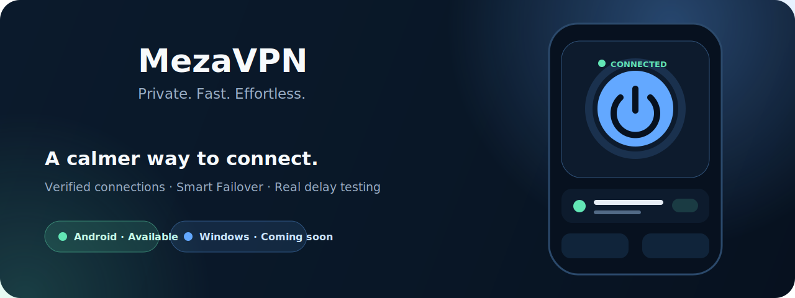

# MezaVPN

### Private. Fast. Effortless.

A focused VPN experience built for quick connections, clear status, and dependable everyday use.

 

 

## Built to feel effortless

MezaVPN keeps the important things close: a clear connection state, practical server testing, and one-tap control. The interface stays calm and readable while the connection engine handles the complicated work underneath.

<table>
<tr>
<td width="50%" valign="top">

### ⚡ Fast decisions

Real delay measurements help surface responsive servers while tests are still running.

</td>
<td width="50%" valign="top">

### 🛡️ Verified connections

“Connected” appears only after the tunnel demonstrates real internet access.

</td>
</tr>
<tr>
<td width="50%" valign="top">

### 🔄 Smart Failover

Optional health monitoring can move the connection to a meaningfully better server.

</td>
<td width="50%" valign="top">

### 🌙 Quiet by design

No advertising or analytics SDKs—just focused controls and clear feedback.

</td>
</tr>
</table>

## Platforms

| Platform | Status | Requirements | Distribution |
|---|---|---|---|
| **Android** | 🟢 Available | Android 7.0 (API 24) or newer | [Official Releases](https://github.com/mehrantabasi/MezaVPN/releases) |
| **Windows** | 🔵 Coming soon | To be announced | This repository |

> Windows support is planned. Availability and system requirements will be announced here when the desktop build is ready.

## Android highlights

- **Smart Failover** with Stable, Balanced, and Responsive behavior profiles
- **Real delay testing** instead of a misleading basic ping
- **Responsive server ordering** as test results arrive
- **One-tap VPN control** with clear connection feedback
- **ARMv7, ARM64, and x86_64** architecture support
- **Android 7.0+** compatibility

## Download safely

Official builds are distributed exclusively through this repository.

1. Open [MezaVPN Releases](https://github.com/mehrantabasi/MezaVPN/releases).
2. Choose the newest stable Android release.
3. Download the attached `.apk` file.
4. Install it and approve Android's VPN permission on first connection.
5. Optionally verify the published SHA-256 checksum before installation.

> Never install MezaVPN from unofficial mirrors or third-party APK websites. Those files may be modified or outdated.

See the detailed [download and installation guide](DOWNLOAD.md).

## Technical details

| Item | Details |
|---|---|
| Current version | **1.2.1** |
| Android package | `com.mehransystem.mezavpn` |
| Minimum Android | Android 7.0 / API 24 |
| Architectures | ARMv7, ARM64, x86_64 |
| Account required | No |
| Ads / analytics SDKs | None |

## Privacy and security

MezaVPN does not include advertising or analytics SDKs. Connection processing takes place on the device and through the VPN server selected by the app. As with every VPN product, server operators and external services may process technical network information required to deliver their services.

- [Privacy Policy](PRIVACY.md)
- [Security Policy](SECURITY.md)
- [Changelog](CHANGELOG.md)

## Support

Found a reproducible problem or have a useful suggestion? [Open an issue](https://github.com/mehrantabasi/MezaVPN/issues/new/choose) and include the app version, Android version, device model, expected behavior, actual behavior, and sanitized logs.

## Official distribution repository

This repository contains official MezaVPN documentation and release downloads. Application source code is not distributed here. MezaVPN is proprietary software; see the [license](LICENSE) for usage terms.

 

**Mehran Tabasi · Mehran System**

Made with care for a simpler and more dependable VPN experience.

