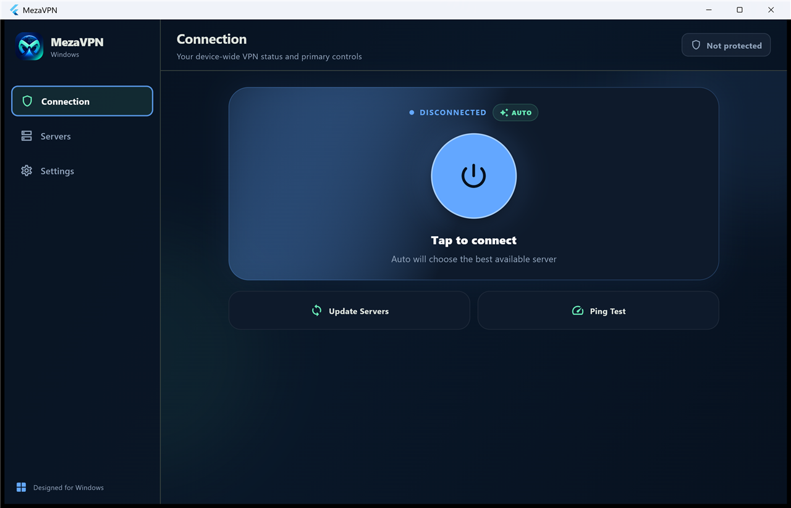

# MezaVPN

### A clear, fast VPN experience for Android and Windows

Simple controls, truthful connection status, and practical server selection—without an account or advertising SDKs.

[Download](#download) · [What’s new](#version-200) · [Features](#made-for-everyday-connections) · [Privacy](#privacy-and-trust) · [Help](#support)

## Version 2.0.0

MezaVPN 2.0 brings the Android and Windows editions together in one coordinated release. Android receives a substantial connection, server-list, and interface update. Windows arrives as a purpose-built native desktop application with dedicated x64 and x86 installers.

| Platform | Package | Requirements | Status |
| --- | --- | --- | --- |
| Android | Universal APK (ARM64, ARMv7, x86_64) | Android 7.0 / API 24 or newer | Stable |
| Windows | Native x64 installer | 64-bit Windows; Windows 11 recommended | Stable, unsigned |
| Windows | Native x86 installer | 32-bit compatibility environments | Stable, unsigned |

> **Windows transparency:** the 2.0.0 Windows installers are published without an Authenticode certificate. Windows SmartScreen may therefore show an “unknown publisher” warning. Download only from this repository and verify the SHA-256 file before running the installer. See the [download guide](DOWNLOAD.md#windows).

## Made for everyday connections

- **Auto or manual control** — let MezaVPN choose a responsive option or select a server yourself.
- **Honest connection state** — the interface confirms usable connectivity before presenting the tunnel as ready.
- **Useful server browsing** — search, availability filters, location sorting, and clear quality feedback help keep large lists manageable.
- **Responsive recovery** — bounded retries and clear terminal errors avoid an endless connecting screen.
- **Low-distraction design** — focused screens, readable states, and controls shaped for each platform.
- **Official update path** — update notices lead back to verified MezaVPN distribution channels.

### Android

- One-tap Auto Location and manual server selection
- Live server refresh and cancellable connection-quality testing
- Improved country, city, identifier, and flag presentation
- Traffic-aware connection recovery designed to avoid needless switching during active use
- Smooth server switching and clearer connection feedback
- Optional notifications and optional anonymous operational statistics

### Windows Native

- Native C++ desktop interface designed for mouse and keyboard
- Auto and manual connection modes with bounded connection attempts
- Unicode server search, availability filters, and response/location sorting
- System-tray controls, startup preference, diagnostics, and live traffic details
- Offline x64 and x86 installers with required runtime components included
- Desktop and Start Menu shortcuts, in-place upgrades, and complete MezaVPN-owned-data removal during uninstall

<strong>See the Windows interface</strong>

 

## Download

Official MezaVPN builds are distributed only through this repository.

1. Open the [latest release](https://github.com/mehrantabasi/MezaVPN/releases/latest).
2. Choose the Android APK or the Windows installer matching your architecture.
3. Compare the file with `SHA256SUMS.txt` attached to the same release.
4. Install and follow the operating system’s VPN permission or UAC prompt.

File-specific instructions, architecture help, checksum commands, and the Windows unsigned-build notice are in the [download and installation guide](DOWNLOAD.md).

> Do not install MezaVPN from APK mirrors, file-sharing channels, or unofficial websites. Those copies may be outdated or modified.

## Privacy and trust

MezaVPN works without creating an account and does not include advertising SDKs. Optional anonymous operational statistics can be disabled in Settings. MezaVPN does not intentionally include browsing history, communication content, contacts, media, precise location, selected server, or VPN configuration contents in those statistics.

- Read the plain-language [Privacy Policy](PRIVACY.md).
- Verify every download with the release checksum file.
- Report sensitive security issues through [private vulnerability reporting](https://github.com/mehrantabasi/MezaVPN/security/advisories/new).
- Review the [Security Policy](SECURITY.md) and [Changelog](CHANGELOG.md).

This is MezaVPN’s official distribution and documentation repository. Application source code is not published here. MezaVPN is proprietary software; see [LICENSE](LICENSE) for the usage terms.

## Support

For a reproducible problem or focused suggestion, [open an issue](https://github.com/mehrantabasi/MezaVPN/issues/new/choose). Include the MezaVPN version, platform and OS version, device/architecture, expected result, actual result, and sanitized logs. Never post credentials, private configuration values, or personal information.

**Mehran Tabasi · Mehran System**

Built with care for a simpler and more dependable VPN experience.

