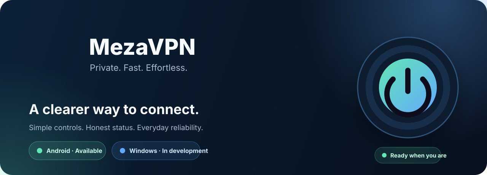

# MezaVPN

### Private. Fast. Effortless.

A dependable VPN experience with simple controls, honest connection status,
and a calm interface that stays out of your way.

[Download](#download) · [Features](#made-for-everyday-connections) · [Platforms](#platforms) · [Privacy](#privacy-you-can-control) · [Support](#support)

## Made for everyday connections

MezaVPN turns a complicated network task into a clear, focused experience.
Choose a location—or let Auto Location make the decision—then connect with one
tap. The app keeps technical noise in the background and shows the information
that actually matters.

- **One-tap control** with clear connecting, connected, and recovery states
- **Auto Location** for effortless server selection on Android
- **Measured responsiveness** to help surface practical, usable connections
- **Verified connection status** before the app reports that the VPN is ready
- **Readable server browsing** with location details and live quality feedback
- **Thoughtful recovery** when an Android Auto connection stops being usable
- **Built-in update notices** that lead back to official MezaVPN downloads

## Platforms

### Android — available now

The stable Android edition is ready for everyday use on Android 7.0 and newer.
It supports ARM64, ARMv7, and x86_64 devices in one official APK.

Android highlights:

- Automatic or manual location selection
- Live server refresh and cancellable quality testing
- Connection verification and clear failure feedback
- Smooth server switching while connected
- Optional announcements and anonymous usage statistics
- A compact interface designed for both narrow and large phone screens

### Windows — in active development

MezaVPN for Windows is a real desktop edition, not a stretched phone layout.
The current development build includes an adaptive desktop interface, automatic
or manual server selection, search and response-quality views, clear connection
details, system-tray controls, startup preferences, and a guided update
experience.

The public Windows installer is being held until signing and release
qualification are complete. This repository will be the first official place
to receive it. Until a Windows asset appears under
[Releases](https://github.com/mehrantabasi/MezaVPN/releases), files offered
elsewhere are not official MezaVPN builds.

## Download

Official MezaVPN builds are distributed exclusively through this repository.

1. Open [MezaVPN Releases](https://github.com/mehrantabasi/MezaVPN/releases).
2. Choose the newest stable Android release and download its `.apk` file.
3. Optionally compare its SHA-256 checksum with the value published in the release.
4. Install the app and approve Android's VPN permission on the first connection.

For compatibility notes and installation help, see the
[download guide](DOWNLOAD.md).

> **Stay safe:** do not install MezaVPN from APK mirrors, unofficial channels,
> or unknown links. They may be modified, outdated, or falsely branded.

## Privacy you can control

MezaVPN is designed to work without an account and contains no advertising
SDKs. Optional anonymous usage statistics can be turned off in Settings.
MezaVPN does not intentionally collect browsing history, communication content,
contacts, media, precise location, or advertising identifiers through those
statistics.

Network services involved in providing a VPN connection may still process the
technical information required to operate. Read the plain-language
[Privacy Policy](PRIVACY.md) for the complete details and limitations.

## Trust and distribution

- Official downloads live only under [MezaVPN Releases](https://github.com/mehrantabasi/MezaVPN/releases).
- Stable release notes and SHA-256 checksums are published alongside downloads.
- Security fixes are provided for the latest stable release.
- Sensitive vulnerability reports can be submitted privately through
  [GitHub Security Advisories](https://github.com/mehrantabasi/MezaVPN/security/advisories/new).

This is the official MezaVPN distribution and documentation repository.
Application source code is not published here. MezaVPN is proprietary software;
see the [license](LICENSE) for the usage terms.

## Support

Found a reproducible problem or have a useful suggestion? Open a
[GitHub issue](https://github.com/mehrantabasi/MezaVPN/issues/new/choose) and
include the MezaVPN version, operating-system version, device model, expected
behavior, actual behavior, and sanitized logs. Never post credentials, private
server details, or personal information in a public issue.

## Project links

- [All releases](https://github.com/mehrantabasi/MezaVPN/releases)
- [Download and installation guide](DOWNLOAD.md)
- [Changelog](CHANGELOG.md)
- [Privacy Policy](PRIVACY.md)
- [Security Policy](SECURITY.md)
- [License](LICENSE)

**Mehran Tabasi · Mehran System**

Made with care for a simpler, clearer, and more dependable VPN experience.

